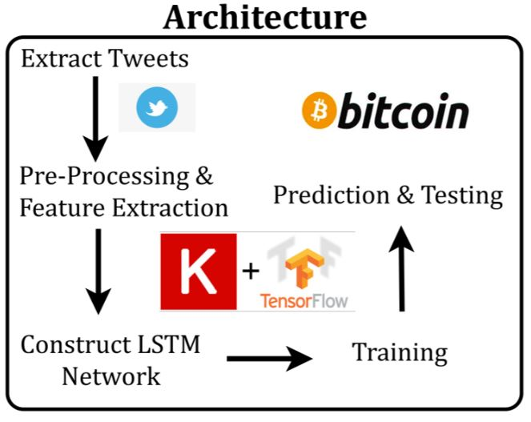
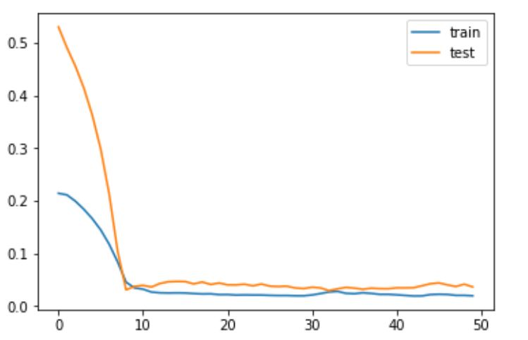

# Crypto-Price-Prediction

**Abstract-** 
Applying machine learning to cryptocurrencies is a relatively new field with limited number of efforts. Our stratergy aims to apply Deep Neural Networks like LSTMs to predict the price of cryptocurrencies based on Social Media Sentiemnt Aanalysis of 1.4 million users posts from twitter and reddit.
  

  
**Results-** 

